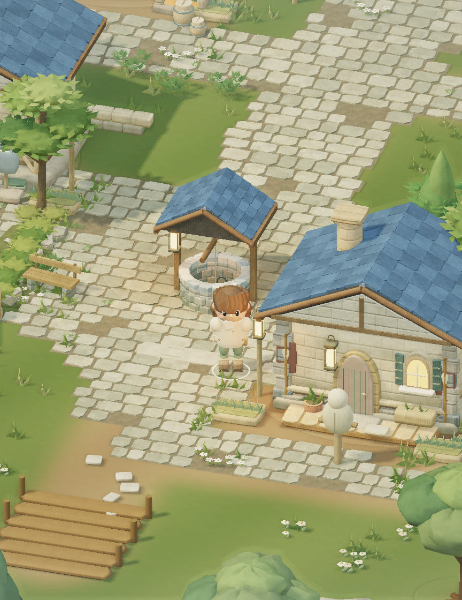
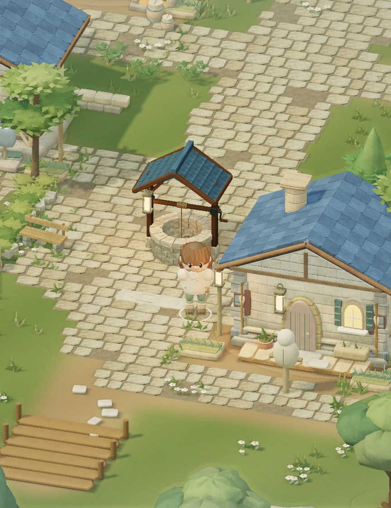
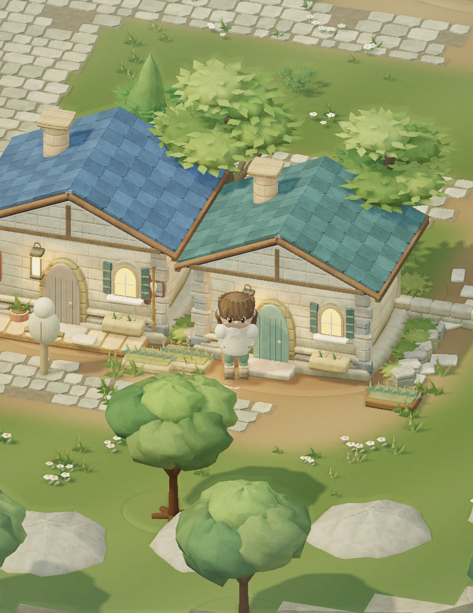
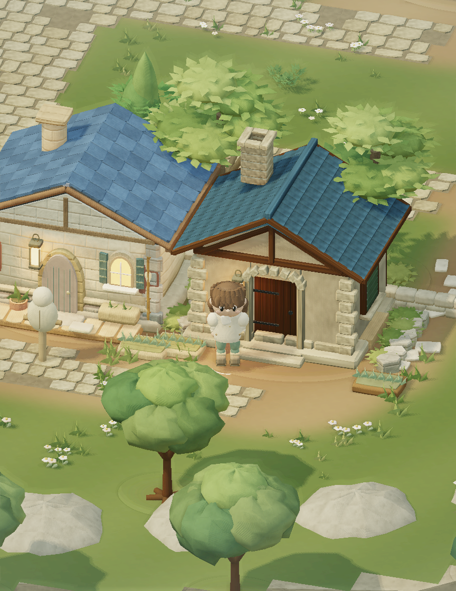
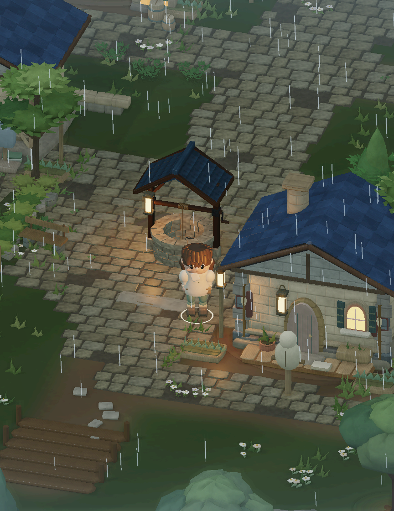

# Plaza craft: material and exemplar asset loop

> **REFERENCE — この領域の技術・実装資料。** ゲームの確定仕様の正本を置き換える文書ではありません。本文の旧ポリシー、WORK固有の指示、PR依存・SHA・検証結果はhistoricalな来歴で、現在の共通運用やGitHub状態には適用しません。[現行の文書案内](README.md)。

Base: `e3502f519dbaea1d399d3a69b274f72f57494059` (latest develop checked again before handoff).
Branch: `work/plaza-crafted-assets-20260910`.

## Plan and delivered scope

The [referenced artist workflow](https://note.com/kurotori4423/n/n2c2d1e2e0770)
informs the authoring process: shared material board → one exemplar → structural
inspection → render under game lighting → specific corrections → reusable asset.
It is not evidence that a particular renderer or AI tool automatically increases FPS.

The first delivery concentrates on the square well, the hunter's cottage inside
the existing Golden district, and the district pavement. Its source is current
develop, not the old GS01 prototype. The well has a continuous inner stone wall,
coping, supported windlass, crank, rope, bucket and slate cover. The cottage has
recessed plaster, timber framing, a stone door surround, plank door with ironwork,
layered roofing, side windows and a hollow chimney cap. Nine original material
swatches provide the shared palette; per-part UVs carry grain and mineral detail.

The existing ordinary cottage at the hunter's school is the exemplar; no new
building, interaction, collider or map layout is introduced. The dojo and character
assets are reserved for their parallel WORKs. Character, movement, age, skills,
combat rules, UI, saves, weather, camera and default tilt-shift remain unchanged.

Next expansion, only after reviewing this exemplar on hardware: apply the shared
material kit to a few foreground props, then improve planted edges/overlap in the
same district. Avoid distributing unfinished changes across every building.

## Implementation

- `tools/author_plaza_craft.py`: deterministic convex meshes, local face UVs,
  shared color/roughness and relief/metal atlases; nearby geometry is ray-tested
  offline for vertex ambient occlusion. AO does not bake a sun direction.
- `src/assets/plaza-craft.js`: separate, strict environment GLB importer retaining
  `TEXCOORD_0` and `COLOR_0.r` AO. Existing character import and bone data are untouched.
- The runtime consumes GLB triangle lists and two 512² PNGs. No authoring dependency,
  runtime ray tracing, per-frame model generation or external asset request.
- Surface **28** is crafted buildings/props; **29** is crafted paving. **24–27 remain
  combat effects**. Static vertex attribute 9 carries UV/AO. Texture unit 5 remains
  the bone palette; new samplers use 7 and 8.
- Pavement uses one color/roughness sample, and its existing bevel geometry supplies
  normals. Only the two detailed assets reconstruct tangent relief. Degenerate UV
  derivatives are guarded. Portrait contexts reuse existing textures instead of
  allocating the two environment atlases.
- Full models have 4,228 / 6,668 triangles. Their shadow proxies have 216 / 56.
  The well proxy retains the opening, and roofs retain solid shadow shells.
  Existing culling and instancing remain active. Low paving casts no additional shadow.

Blender 4.3.2 was attempted but its extracted executable could not be kept intact
and did not start in this workspace. Repeated downloads were stopped. These assets
were authored with Python, NumPy, SciPy and Pillow; no `.blend` or Blender render is
claimed. The GLB uses the game's packed material convention, so an unrelated GLTF
viewer will not reproduce the game's materials without that adapter.

## Single-agent loop and stopping rules

No subagents were used. Structural checks and visual review are separate passes by
the same agent, not independent human approval.

| Iteration | Observation | Correction / verification |
|---|---|---|
| Baseline | Shared world-coordinate textures cannot orient wood per component; well/cottage assemblies are primitive batches | Freeze develop, seed, camera, light and image size |
| 1 | New surface 24 collided with existing silk combat material; well vanished and pavement became ribbons | Reserve 28/29, preserve combat branches; add a material-range regression test |
| 2 | Mineral pattern was directional; detailed shadow geometry increased cost | Isotropic mineral mottling; hollow well / roof shadow proxies |
| 3 | Sequential timing varied heavily; alternating A/B found rain overhead | Limit tangent-relief sampling to well/cottage; pavement uses one sample |
| Final | Roof column gaps needed continuous decking | Add 48 triangles total; ray-test gaps on both slopes; final captures and full suite |

Each loop needs a concrete visible defect or measured risk. Change one source of
that defect, retain the comparison conditions, and retest it. Repeated low-value
benchmarking and repeated attempts to launch an unavailable tool are cut. A failed
check becomes a regression guard where useful. Completion never substitutes an
authoring render for the game shader, and never infers hardware FPS from software.

## Visual evidence

864×1120, seed 7349, time 0, medium quality, actual gameplay camera calculation.
The well camera uses player `(1.8,16)` and cottage camera `(12,19)`; camera yaw `.3`,
pitch `.52`, zoom `12.497142857`. Each comparison uses identical simulation state,
projection and lighting. The images below are **offline EGL renders of real game
geometry, shaders, uniforms and drawBatches**, not browser screenshots. UI and
animated bone transitions are not reproduced; the offline post pass does not run
the live tilt-shift blur, making the material differences visible directly.

| View | Develop | Final |
|---|---|---|
| Well / paving |  |  |
| Cottage |  |  |
| Rain |  |  |

Visual review confirms clearer construction, localized contact shading and a more
consistent warm mineral / cool slate palette. The reference's overall vegetation,
composition and character quality is not claimed to be matched by this small patch.
Bloom, fog, lighting intensity, depth-of-field and render scale were not increased.

## Reproduction

Authoring: `python3 tools/author_plaza_craft.py` (Python 3.12, NumPy, SciPy, Pillow).
Runtime/build: `npm ci && npm test`. Offline rendering additionally needs
ModernGL, glcontext and an EGL driver; these are optional developer dependencies.

```sh
node tests/export_scene.mjs . /tmp/plaza-after '{"width":864,"height":1120,"x":1.8,"z":16,"gameplayCamera":true,"weather":"clear"}'
python3 tests/render_offline.py /tmp/plaza-after public/assets
```

Export the baseline from a detached worktree of the base SHA with the same options.
Use `weather:"rain"` for wet materials and `(x:12,z:19)` for the cottage view.
For a paired timing check:

```sh
python3 tests/compare_offline.py /tmp/plaza-before /path/to/base/public/assets /tmp/plaza-after public/assets /tmp/plaza-paired.json
```

## Validation and budget

Measured results and their exact scope are appended below. All hardware/Pixel Fold FPS, native
WebGL frame pacing and interactive browser verification remain **UNVERIFIED**.
This environment has no usable Chromium binary. Existing core and interaction
tests run normally; no visual screenshot is used to infer gameplay correctness.

| Budget, well camera | Develop | Final |
|---|---:|---:|
| Triangles, including static shadow refresh | 502,604 | 499,960 |
| Draw calls, including static shadow refresh | 67 | 72 |
| Steady clear calls, including post resolve | 47 | 50 |
| Steady rain calls, including rain + post | 48 | 51 |
| Submitted color instances | 2,614 | 2,454 |
| New environment atlas allocation, including mipmaps | — | 2.67 MiB |

The GLB adds 1,611,496 bytes on disk plus two compressed PNGs. The new material
buffer adds approximately 0.38 MiB of UV/AO vertex data across the four models;
the complete new position/normal/UV/AO buffers are approximately 1.15 MiB.
This is a quality tradeoff with fewer submitted triangles, not a claim of lower
memory or fewer draw calls. The broad landscape test retains a bounded budget
of 77 calls (baseline limit 72 plus five explicit crafted draws).

Paired software measurements: llvmpipe LLVM 20.1.2 / Mesa 25.2.8, same EGL context,
12 warmup pairs and 60 measured pairs, alternating AB/BA. No test suite or second
renderer benchmark ran concurrently. Raw intervals and settings are retained in
`visual/plaza-craft/paired-*.json`.

| Weather | p50 before → after | p95 before → after | Median paired after/before |
|---|---|---|---|
| clear | 130.21 → 133.44 ms | 210.76 → 209.29 ms | 0.990 |
| rain | 141.08 → 141.60 ms | 281.60 → 314.54 ms | 1.066 |

The final clear comparison is near parity; rain's paired median is 6.6% slower,
with a worse p95. Earlier paired rain cost was 10.6% before the paving shader was
simplified. The shared host has large outliers, so these runs neither demonstrate
hardware speedup nor establish stable native frame pacing. Do not repeatedly run
this software benchmark hoping for a better number. Validate the final assets on
hardware before expanding their use across the village.

Regression coverage includes simulation immutability during scene authoring,
seed-stable layout, well opening and existing well collision/movement checks,
finite/nondegenerate geometry, normalized normals, retained UV/AO, atomic rejection
of corrupt assets, material/character sampler separation, culling, shadow proxies,
bounded draw calls and capacity reuse. Existing gameplay/UI/save/animation tests
remain in the full test command. Both environment and character shader interfaces
link successfully in the offline renderer.

The paired timings were captured after the paving optimization, before the final
roof-deck correction (24 additional triangles per model, same shaders and draw
counts). Final geometry/capture numbers above include the decking. This tiny mesh
change was checked with renders, roof-gap rays and the full suite; a further
software timing loop was cut because it would not resolve hardware performance.

Final build and regression: **npm test — 361 PASS, 0 FAIL** (including build).
Offline clear/rain/cottage renders and environment/character shader links: PASS.
Browser, hardware GPU and Pixel Fold: UNVERIFIED. Merge remains Integration WORK's job.
