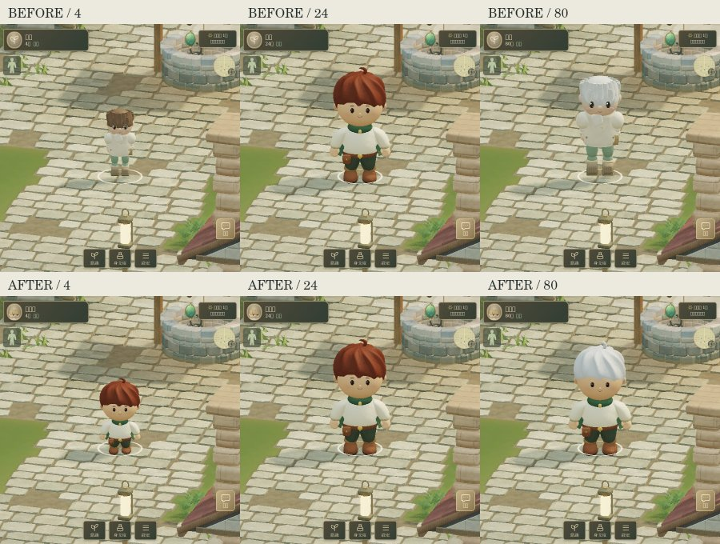
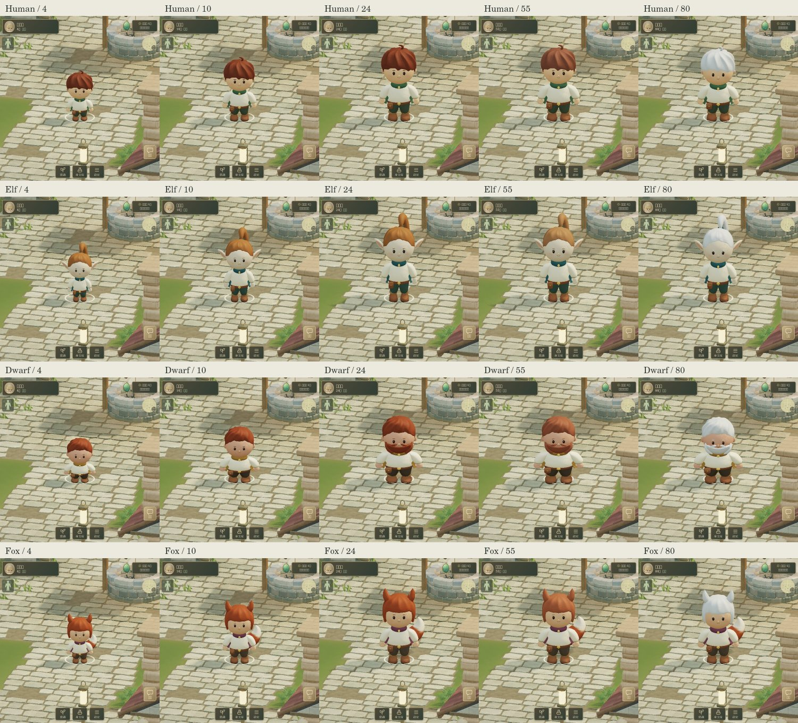
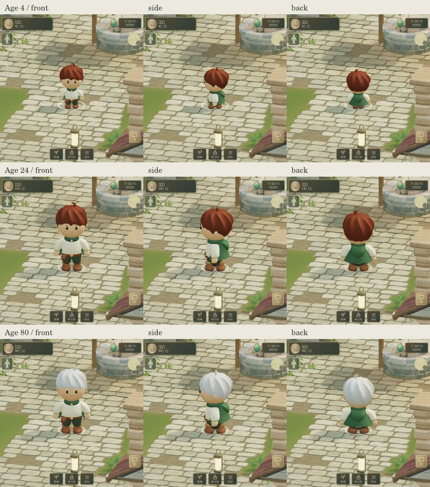

# Age continuity for the four travelers

Base: `eabe0cba5577949350058b1e1e3bd41bc6c7c5f3` (latest develop fetched 2026-09-09).
Branch: `work/character-age-continuity-20260909-v2`. Target: `develop`; no merge by Character WORK.

The approved traveler previously existed only from age 18 through 34. At 18 and 35 the local player changed between unrelated models. This change carries the same face, connected hairline, hairstyle, ears and costume through infancy, childhood, adulthood and old age.

Scope is the same four approved local player identities: human male, elf female, dwarf male, fox female. Their other gender variants, remote players, NPCs and UI portraits retain the existing renderer. This PR does not change the game's gender selection or add age models to those other renderers.

The initial age implementation was verified against `957362c` and submitted as PR #55. Develop then incorporated PR #50 (authored traveler sword clips), creating overlapping edits. This replacement branch starts from updated develop `eabe0cb`, preserves those clip changes and scales their translation deltas to the current age. No develop merge or force-push was performed. The original branch/PR remains as provenance.

## Visual design

The human child/adult/elder turnaround concept was generated once in the conversation before modeling. The screenshots below are actual game renders, not that generated concept.

- Shorter legs, a shorter torso, proportionally fuller head and cheeks in childhood; body depth stays substantial.
- The approved young adult proportions remain unchanged. The connected trousers and hairline use the same topology at every age.
- A slightly fuller torso in middle age; silver hair, softer face proportions and a small upper-body posture change in old age. Hair partition and cowlick/ponytail remain recognizable.
- Dwarf children have no beard. The existing beard grows continuously during the visual transition from 14 to 18.
- The infant is held in the existing parent's arms. Short arms and legs fold gently, then unfold using the existing lowering clock. The simulation still decides when the parent releases the child.

Visual interpolation landmarks use the existing `appearanceStage` boundaries (4, 10, 18, 35, 55, 72); gray hair uses the existing 48/65-era visual direction with continuous interpolation. These are presentation curves, not new aging/lifespan/progression rules. In the cradle sequence, the visual infant-to-child transition follows the existing final 1.45-second lowering window, reaching the age-4 shape at release.

## In-game comparison







[Cradle](evidence/cradle.jpg) · [Released child](evidence/released.jpg)

## Implementation and cost

`traveler-age.js` defines the presentation profile and matching CPU/GPU rest-position mappings. `traveler-runtime.js` maps the small joint palette into those proportions, then uses the existing movement, impact and ground-contact paths. The vertex shader maps rest positions and normals identically in color and shadow passes.

One rest mesh per race, two existing LODs, 16 bones (fox: 17), at most four weights. Geometry and texture buffers are not rebuilt on birthdays or growth frames. No new textures, geometry counts, draw calls, postprocessing or cloth simulation are added to the traveler. Lower screen coverage can select the existing lower LOD sooner for small children. The standalone build grew by approximately **5.9 KB** (about 0.03%). The two-entry CPU model cache and single active GPU character are retained.

Young equipment uses the existing equip permission and attachment points with visual size fitted to the body. Player coordinates, collision radii, movement speeds, combat clocks, skill rules, age progression, lifespan, family data and save format are untouched.

## Verification

- `npm test`: 457/457 PASS, including native GLSL ES compile/link and new age-continuity/ground-contact tests.
- `node deploy/build.mjs dev` and `node deploy/check-build.mjs dev`: PASS.
- The age tests exercise all four rigs at ages 4, 10, 17.99, 35, 55, 72 and 99 while moving/stopping at three speeds. They check finite transforms, fixed support feet, CPU/GPU geometry reuse, immutable snapshots, continuous boundary profiles and parent-release proportions.
- Native browser age/model, input, release and save/reload checks: **49/49 PASS**. Captures and relative software timing: see `evidence/browser-report.json` (populated by `tests/character-age-browser.mjs`).

Reproduce browser evidence after building:

```sh
CHARACTER_BASELINE=/path/to/base/dist/index.html \
CHARACTER_BASE_SHA=eabe0cba5577949350058b1e1e3bd41bc6c7c5f3 \
node tests/character-age-browser.mjs
```

The timing comparison uses nine completed frames after three warm-up frames, synchronizing the test with one-pixel readback. Before/after run sequentially at the same viewport, camera, village, medium quality and clear weather. The final comparison values are recorded in `evidence/browser-report.json`.

The sequential samples were noisy: the age-80 sample initially rose from 1545.6 to 2375.7 ms. To investigate that largest difference, `tests/character-age-performance.mjs` alternated before/after in the same session (three warm-up pairs and fifteen measured pairs, with idle background pages). [Raw paired samples](evidence/paired-performance.json) give:

| Age-80 scene | Before | After |
| --- | ---: | ---: |
| Completed render median (SwiftShader) | 1464.4 ms | 1397.2 ms |
| CPU submission median | 16.3 ms | 14.5 ms |
| Draw calls | 40 | 40 |
| Scene triangles | 169,886 | 168,050 |

The earlier slowdown did not reproduce in this alternating diagnostic. These software-renderer results do not establish a hardware speedup or rule out device-specific regressions. Both the sequential and paired results are retained. Young-adult screenshot scale and proportions remain the same under the matched camera.

This is a bounded regression diagnostic chosen for this focused visual task. It is not a sustained native-hardware benchmark. No readback is added to the production game loop.

Native Pixel Fold performance, all individual skill choreographies and all possible childhood/elder equipment combinations are not certified. This is an age-continuity update, not commercial Golden Master certification.

Sources: attached Common Development Policy **v5 Ready PR** and implementation prompt v2.0. The user's explicit GitHub PR authorization and v5 supersede the older no-GitHub-write/handoff-only instructions. Existing game behavior was audited directly in this pinned develop; the old recovery HTML was not used.
