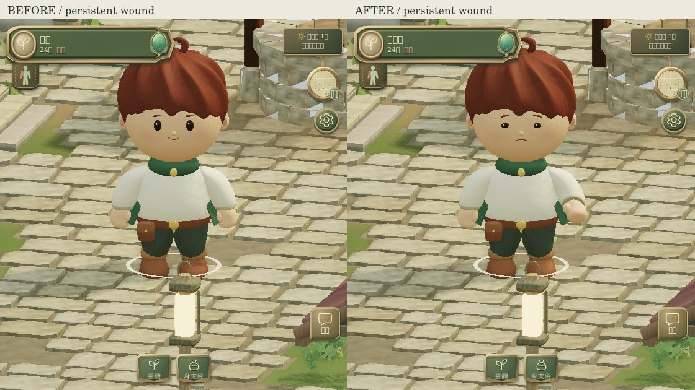
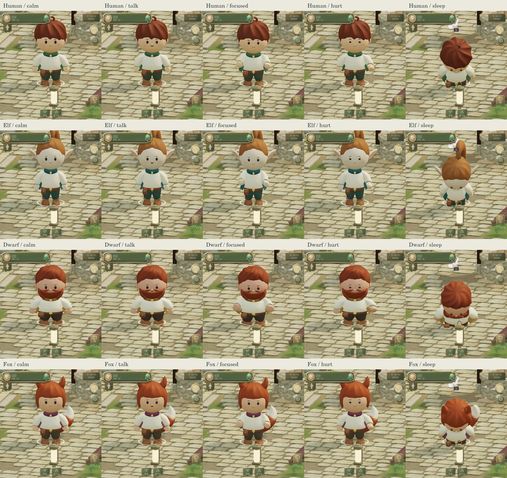
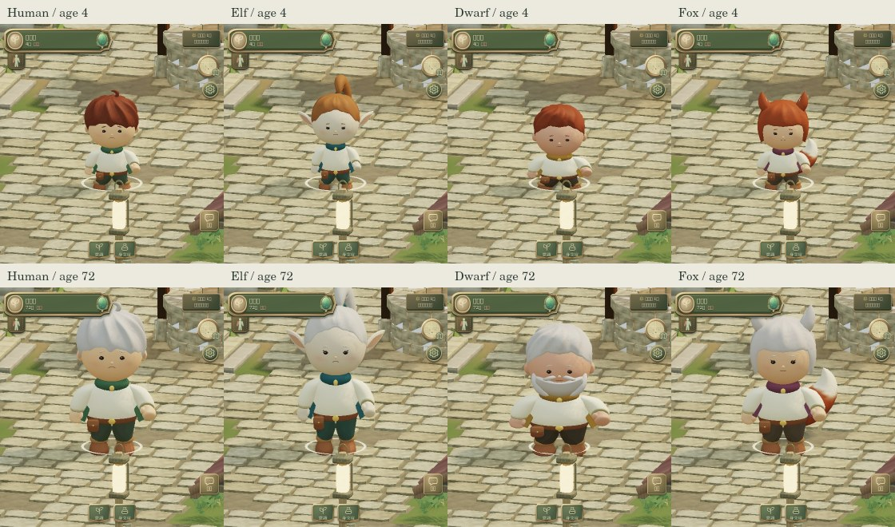

# 新モデルの表情と持続する負傷姿勢

BASE_BRANCH: develop

BASE_COMMIT: `10fb501e635f953c529dfbfc6898d8c0fd21e66c`

BRANCH: `work/traveler-expression-injury-20260909-v2`

新しい4種族のトラベラーモデルに限定した描画更新。人族男性・エルフ女性・ドワーフ男性・狐女性の既存適用範囲を維持する。旧モデルの顔・姿勢・適用範囲は変更しない。

## 表情

- 普段の穏やかな顔と、見た目seedに応じた自然な瞬き。
- 発話中の小さな口の開閉、戦闘時の集中した眉・目、休息時の柔らかな目。
- 被弾中の痛み顔、その後も傷が残る間の困り眉・細めた目・下がった口角。
- 眠り・行動不能・死亡時は目を閉じる。状態が解消すると滑らかに戻る。
- 既存の `speechUntil` / `hitReactUntil` / wounds / statuses / lifeState を読む。独自の感情・負傷データを保存しない。

目・ハイライト・眉・口の既存頂点にregionを付け、頂点シェーダーで小さく変形する。通常顔は既存の座標を維持。まぶたを閉じるとハイライトも消える。色・影の両passに同じ変形を適用し、目・眉の法線も補正する。

## 負傷中の動き

軽傷と重傷の程度に応じ、傷ついた腕の肘を曲げて保持し、胴の傷では少し前屈、頭の傷では少し俯く。脚の傷では荷重の左右差と、遊脚の持ち上げを控える動きを加える。両脚負傷は左右差を相殺し、小さな前傾を保つ。

移動距離に基づく既存歩行位相、接地済みの足位置、Ground IKを維持する。Player座標・移動速度・Collision・ダメージ・回復速度・攻撃時計は変更しない。現在の被弾モーションと短いrecoilも維持する。

攻撃・溜め・回復動作・防御・被弾直後・パルクール・救助・行動不能・起き上がりでは、持続負傷の姿勢を即時に退かせて既存動作に制御を渡す。表情は継続する。部位欠損は既存mask/装備処理が担当し、欠損を新たな永続痛み状態として扱わない。

## 見た目と検証







画像は本編をChromiumで実際に描画したもの。種族・カメラ・代表状態はfixtureで固定し、傷の発生・キー移動・治癒・行動不能は本編Simulationを使用する。UIやEnvironmentの変更は含まない。

- `npm test`: **508 tests PASS**。状態優先度・治癒への遷移・両LODの顔領域・4種族×5負傷部位×武器有無の接地・snapshot不変性・攻撃への制御引き渡しを含む。
- Native GLSL ES: 既存12プログラムのcompile/link PASS。
- Deployment build / integrity PASS。
- 本編ブラウザー: **35 checks PASS**。確認結果: [browser.json](evidence/browser.json)。CPU比較: [cpu.json](evidence/cpu.json)。
- 新規テクスチャ・頂点・三角形・骨・描画passなし。LODと単一GPU characterを維持。追加は小さな描画状態と3個のuniform。
- 他検証終了後の独立したCPU比較3組のpose更新中央値: Before **0.134〜0.176 ms** / After **0.161〜0.174 ms**。p95はBefore **0.272〜0.520 ms** / After **0.324〜0.341 ms**。今回の計測分布は重なっている。描画回数は同条件の通常/負傷で25→25、scene trianglesは61,920→61,920。睡眠時の既存状態VFXはこの比較に含めない。
- standalone増分は約**5.6 KB**。Pixel Fold実機のGPU性能は未確認。CPU比較はWebGL呼び出しをstubした計測で、実機FPSの保証に使わない。

```sh
npm test
CHARACTER_BASELINE=/path/to/base/dist/index.html \
CHARACTER_BASE_SHA=10fb501e635f953c529dfbfc6898d8c0fd21e66c \
node tests/character-expression-browser.mjs
CHARACTER_BASE_SHA=10fb501e635f953c529dfbfc6898d8c0fd21e66c \
node tests/character-expression-performance.mjs
```

## Integration向け

主な変更: `traveler-model.js`（顔領域）、新規 `traveler-expression.js`（表情・負傷姿勢）、`traveler-runtime.js`（shader・姿勢・uniform）。Buildとテスト/レビュー用ローダーに新moduleを追加。Simulation・旧モデル本体・UI・Environmentは変更しない。削除ファイルなし。

PR #65のCI待機中に地形PR #54と年齢継続PR #56がdevelopへ統合されたため、最新baseからv2 branchを作成して再適用した。公開済みbranchの履歴は書き換えない。v2では **元の顔座標 → travelerFace → agePosition → skinning** の順に接続済み。法線もface変形後にageNormalへ渡す。年齢別bind/頭部比率・抱っこ・武器年齢制限、地形通過時の接地、現在developの被弾profileを維持する。眉・目・口のregion20〜26と、年齢による髭region13の表示条件を併存させた。4種族それぞれ4歳・72歳の負傷表情も本編で描画し、実年齢値と描画中のSimulation不変性を確認。

仕様参照は添付共通運用ポリシーv5と実装プロンプトv2。ユーザー指定の新モデル限定・軽量な表現を優先。Ready PRまでを担当し、mergeしない。
