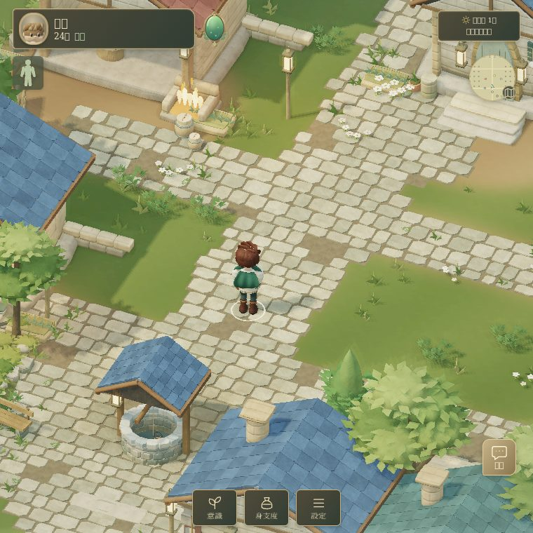
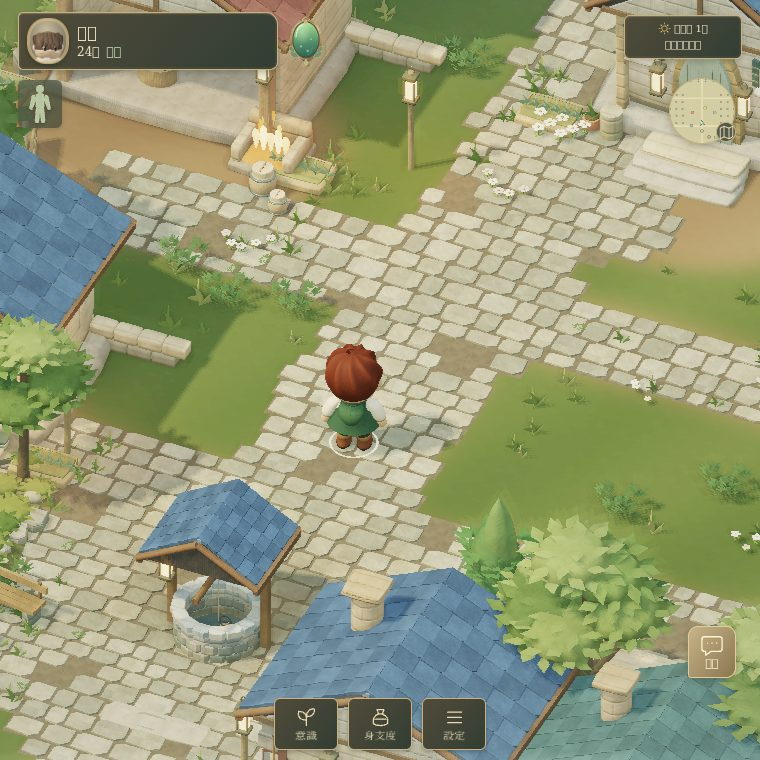
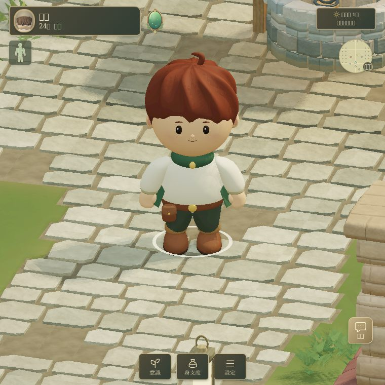
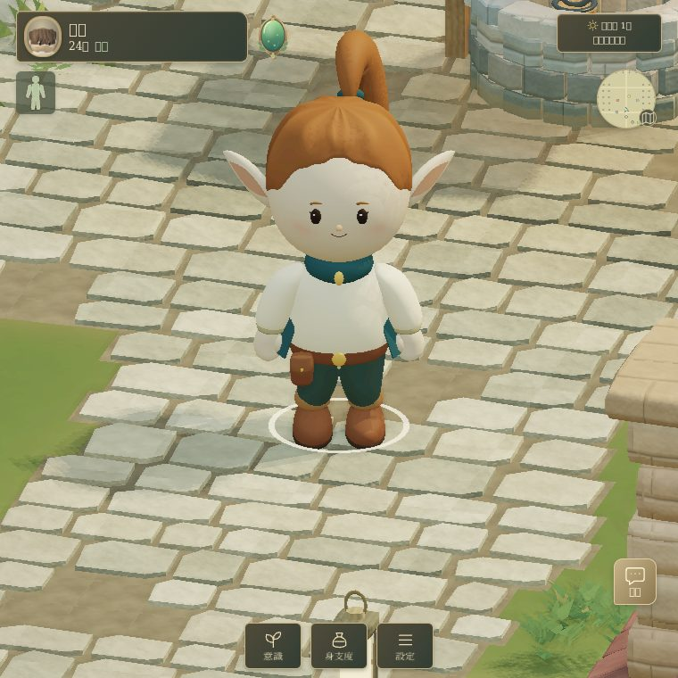
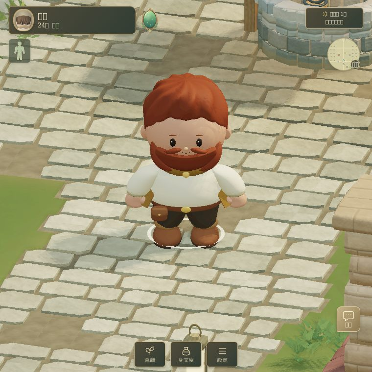
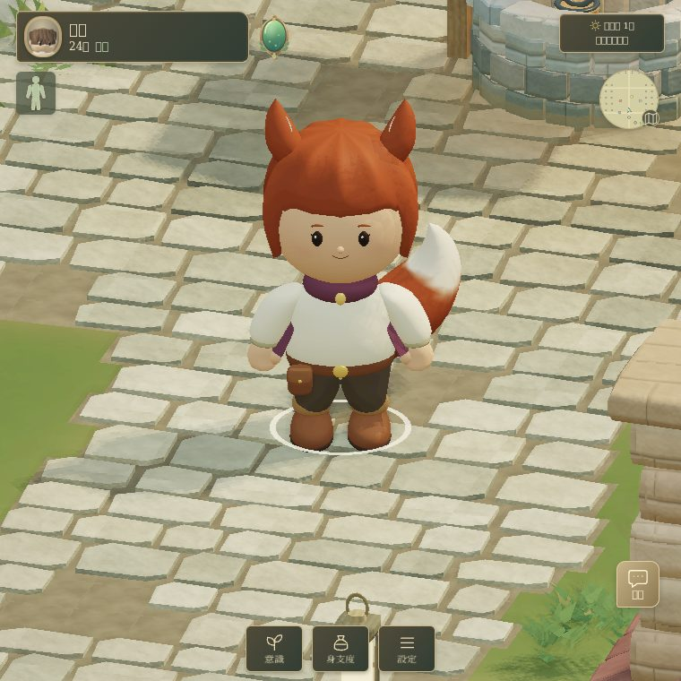
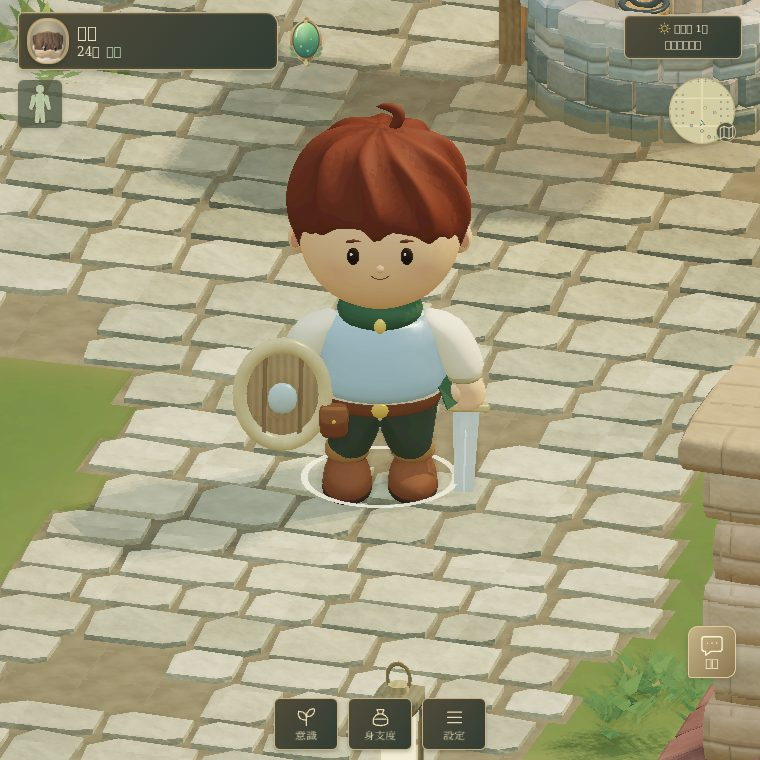
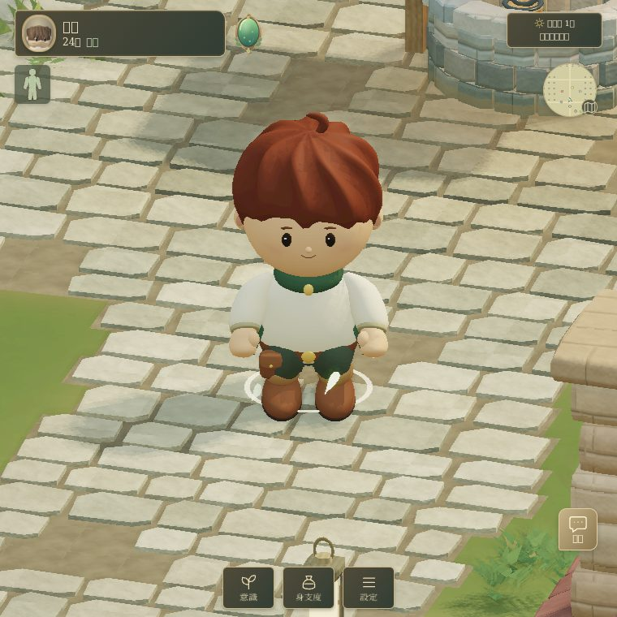

# Four travelers in the existing game

> **REFERENCE — この領域の技術・実装資料。** ゲームの確定仕様の正本を置き換える文書ではありません。本文の旧ポリシー、WORK固有の指示、PR依存・SHA・検証結果はhistoricalな来歴で、現在の共通運用やGitHub状態には適用しません。[現行の文書案内](../../README.md)。

The accepted compact character designs now render inside the current village, using its existing lighting, shadows, terrain and camera. This is the game integration of the approved prototypes, not a new commercial Golden Master certification.

Implementation base: `717931fd92271104b89a9c5645ed4792bbf06c2e` (latest `develop` fetched for this work). Branch: `work/character-four-travelers-20260909`.

## Scope

| Existing race | New local-player sample | Age |
|---|---|---|
| Human | Male | 18–34 |
| Elf | Female | 18–34 |
| Dwarf | Male | 18–34 |
| Fox | Female | 18–34 |

Other ages, genders, prologue characters, portraits and NPCs continue through the existing character path. This preserves childhood, growth and family selection behavior. The implementation changes no simulation, input, collision, save schema, UI, environment or skill definitions.

## Visual and motion integration

- The accepted procedural model shapes and continuous hairline were selectively ported into `traveler-model.js`. The recovery HTML was not used as the implementation base. Existing renderer, character pipeline and shaders stay in place.
- A compact 16-bone rig (17 for the fox tail) adds elbows, wrists, knees and foot sockets around the existing proportions. Vertex weights are bounded to four. Boots and cuffs remain rigid to avoid tearing during folded-leg poses.
- Locomotion advances from actual displacement. Support anchors and two-bone leg IK adjust only rendered joints and pelvis height. Idle does not add a perpetual head wobble or body bounce.
- Existing motion/state functions supply combat, hit, guard, rest, rescue, incapacitation, traversal and death poses. Existing skill clocks, movement and hit tests remain authoritative. This does not certify every individual skill's visual choreography.
- Weapon/shield geometry and weapon-tip registration attach to the new hands. Existing arm/leg loss masks and armor state are consumed by the new mesh.
- Materials use vertex color with distinct skin/hair/cloth/leather/metal response, existing environment light and shadows. No new texture atlas, glow or post-processing pass is added.

## Cost

| Sample | LOD0 triangles | LOD1 triangles | Bones |
|---|---:|---:|---:|
| Human | 17,848 | 10,850 | 16 |
| Elf | 18,936 | 11,798 | 16 |
| Dwarf | 19,436 | 11,654 | 16 |
| Fox | 18,936 | 11,450 | 17 |

Each sample has one character material, one color draw and one shadow draw. Optional hidden armor geometry is included in these counts. LOD uses hysteresis; mesh generation happens on character creation, not per frame. CPU model caching is bounded to two samples; GPU resources are disposed when changing samples. The existing CM01 asset load remains unchanged; removing that baseline cost is outside this integration.

Current gameplay HTML: 12,483,344 bytes; base: 12,438,720 bytes (+44,624 bytes / about 0.36%). Same-scene draw counts and measured software-render timing are recorded in `evidence/browser-review.json`. Software rendering is not a Pixel Fold or native GPU performance approval.

An isolated 760×760 medium-quality idle sample (20 frames after warm-up, synchronous one-pixel readback) measured 1,271.5 ms → 973.2 ms per completed software-rendered frame, and 14.9 ms → 14.8 ms CPU submission. Draw calls stayed at 39; scene triangles changed from 188,952 to 175,786. These are diagnostic SwiftShader measurements, not hardware FPS or a device performance guarantee.

## Verification and evidence

- `npm test`: 263/263 pass, including simulation, UI, skills, collision, save and the new character tests.
- Deployment build and embedded asset integrity: pass.
- Native browser checks and measurements: see `evidence/verification-summary.json` and `evidence/browser-review.json`.
- Screenshots are actual Chromium/SwiftShader game renders. Camera, scene, quality, weather and lighting are matched between before and after. Close-up views use a second camera to avoid the foreground roof. Fixture screenshots do not stand in for native-input tests. The small pale leaves around a resting character are the existing rest effect, not mesh tears. Some Japanese UI glyphs are missing in the local capture environment; UI sources are unchanged.
- Native keyboard/pointer, contact combat, equipment and native HTTP localStorage reload are checked by `tests/character-browser.mjs`. CI native-input and equipment artifacts are available from the PR's Character visual verification job.

### Gameplay comparison

| Before | After |
|---|---|
|  |  |

### Current four samples

| Human | Elf |
|---|---|
|  |  |

| Dwarf | Fox |
|---|---|
|  |  |

### Attachments and rest

| Equipped | Rest |
|---|---|
|  |  |

## Reproduce

```sh
npm ci
npm ci --prefix deploy --ignore-scripts
npm test
node build.mjs
# Build the recorded base in a separate worktree first.
CHARACTER_BASELINE=/tmp/character-baseline/dist/index.html \
CHARACTER_BASE_SHA=717931fd92271104b89a9c5645ed4792bbf06c2e \
CHARACTER_MODE=functional node tests/character-browser.mjs
CHARACTER_BASELINE=/tmp/character-baseline/dist/index.html \
CHARACTER_BASE_SHA=717931fd92271104b89a9c5645ed4792bbf06c2e \
node tests/character-travelers-evidence.mjs
```

A Chromium installation is required. `CHROMIUM_EXECUTABLE` optionally selects a local binary; `CHARACTER_NO_VIDEO=1` permits local checks without the Playwright recorder. CI retains its normal Chromium/video setup. `CHARACTER_AFTER_ONLY=1` narrows functional checks to the changed build. Run the timing capture without a competing browser workload.

No merge or deployment to shared DEV is performed by this WORK. The repository deploys shared environments after integration; its PR workflow provides build artifacts rather than a public branch preview.
