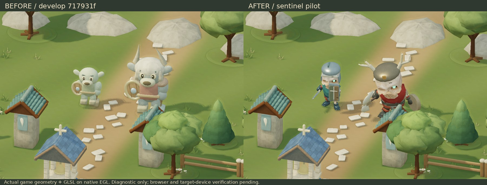
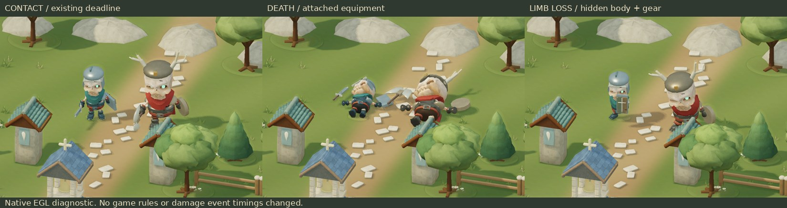

# Enemy Character / Creature Quality — soldier / elite pilot

## Scope and baseline

- Repository: `charukun/bloodline-legacy`; branch: `work/enemy-creature-quality`.
- Latest `develop` fetched at start and rechecked before submission: `717931fd92271104b89a9c5645ed4792bbf06c2e`.
- Read Project Sources: Common Development Policy v5 (Ready PR), Implementation Prompt v2, enemy/combat/damage/visual/performance specifications. The current user instruction and v5 authorize branch publication and Ready PR to develop. Integration WORK owns merge.
- Inspected reference A (movement MP4), B (village), C (lineage), D (combat); do not redistribute reference pixels. Attached HTML is a historical reference, not the implementation source.
- Actual develop uses custom WebGL2, GPU bone palettes and standalone HTML asset embedding. There is no Three.js dependency. This implementation preserves that architecture and requires no Blender process.
- Replaces only `soldier` (盾持ちの異形) and `elite` (冠角の執行者). Existing names, AI, resolve, damage, attack deadlines, collision radii, rewards, save schema and rules are unchanged. Body proportions and presentation sockets are intentional visual changes.





Detailed costs and raw measurements: [PERFORMANCE.md](PERFORMANCE.md).

## Asset selection and audit

| Candidate | Asset-specific evidence | Technical result | Decision |
|---|---|---|---|
| KayKit Skeletons 1.0 / Skeleton_Warrior | [Author repository, pinned source](https://github.com/KayKit-Game-Assets/KayKit-Character-Pack-Skeletons-1.0/blob/15b62b9bad122f72926c10fb14d622c73819fa54/addons/kaykit_character_pack_skeletons/Characters/gltf/Skeleton_Warrior.glb); [pack](https://kaylousberg.itch.io/kaykit-skeletons); same-commit LICENSE.txt | Articulated fingers/limbs, named hand sockets, 95 source clips, readable stylized skull and armored silhouette. Direct GLB. Related models in the same author series allow future expansion. | Adopted as the single external source. |
| Quaternius Orc Enemy | [Individual asset](https://poly.pizza/m/Q3z8ZX4kUy), CC0 credit to Quaternius; [author Ultimate Monsters](https://quaternius.com/packs/ultimatemonsters.html) | Downloaded GLB: 146,420 bytes, Orc_Blob with four bones. No articulated arm/hand anatomy for the current armed-humanoid combat and limb damage contract. | Rejected for this pilot; not shipped. |
| Existing procedural enemies | Current develop art | Low maintenance cost; specialized silhouettes fit crawler, maw, wraith and wildlife. | Preserved. No forced uniform replacement. |

Kay Lousberg's source pack explicitly permits commercial use and makes credit optional. [CC0 1.0](https://creativecommons.org/publicdomain/zero/1.0/) permits copying, modification and redistribution, including game embedding and the modified GLB in this repository. CC0 does not grant trademark/patent rights or imply endorsement. The selected GLB is under the author's same-commit pack license, not an assumption about the hosting site's general policy.

Audit records: `public/assets/enemies/provenance.json`, exact author `KayKit-LICENSE.txt`, official `CC0-1.0.txt`, input/output SHA-256 in `asset-report.json`. Acquisition date: 2026-09-09. No source accessory, logo or reference image is imported. The original stock helmet is removed; all new equipment is authored in `src/enemies/equipment.js`.

## Bloodline Legacy adaptation

- Soldier: short open-face iron sallet, asymmetric damaged cheek plate, split wooden tower shield, broken-branch emblem, worn straight sword, muted teal cloth.
- Elite: larger and wider body, asymmetric branching ivory crown, shoulder horns, brass ironwork, red mantle strips, double axe and round buckler. Distinction comes from body, silhouette, gear, weapon, palette and existing slower elite attack windup.
- Warm bone, weathered metal/leather and small deterministic wear/tint variation use the existing lighting, surface response, fog, local impact lighting, rim and shadow system. No new global lighting or postprocess is introduced.
- Source color atlas is baked into linear vertex colors. The shader derives cloth/metal variation from a custom surface attribute, using existing game material responses. No additional image textures are sampled.
- Existing head/torso/limb wounds remain visible as persistent marks. Lost limbs are hidden in color and shadow passes; lost-hand weapons/shields are omitted. Status markers are raised to the new silhouette height.

## Animation / combat integration

| Existing presentation state | Mapping |
|---|---|
| Stationary / guarded soldier | Idle_Combat / Block |
| Movement | Running_A phase advances from actual snapshot distance (guard flag cannot mask locomotion) |
| Enemy telegraph | 1H_Melee_Attack_Chop, source time 0 → 0.61 seconds over the existing telegraph window |
| Existing melee resolution | Exact source downstroke pose at the existing `telegraph.at`; no damage event is moved |
| Attack recovery | Source time 0.61 → clip end over existing actionStarted/actionUntil |
| Lost right arm | Unarmed_Melee_Attack_Punch_A, mirrored onto the surviving left hand/shield; existing deadline maps to source time 0.50 |
| Hit / death | Hit_A / Death_A; consumes existing reaction/death clock |
| Hitstop / other transitions | Existing renderPoseTime and damage/ailment motion; short pose blends only for noncritical states |

The imported x/z root motion is removed; Simulation still owns movement. Hand/head/chest sockets attach original equipment. VFX contact positions read the rendered body bones and weapon tips. Final equipment transforms bypass a second rigid-part crossfade so gear stays attached. Snapshot purity and exact windup/recovery continuity are covered by tests. No new combat decision logic is introduced.

## Build and validation

- Distribution integrity: `node deploy/build.mjs dev` and `node deploy/check-build.mjs dev` PASS. The first CI run caught the new GLB missing from the explicit embedded-asset list; the list now includes it and still checks every embedded asset byte-for-byte.
- `npm ci`, `npm test`: build and **269 tests passed**, zero failures/skips. Full result saved in `evidence/tests.txt`.
- Focused coverage: two-type eligibility, GLB bounds, 23-bone budget, finite seven-state poses, real soldier guard flag during movement, exact strike deadline, snapshot immutability, hitstop, wounds/lost hands, shared geometry and palette cleanup.
- Khronos glTF Validator: **0 errors, 0 warnings**, report `evidence/gltf-validation.json`. No external buffer/image URI, decoder or required extension.
- `node tools/enemies/build-review.mjs` creates `dist/Bloodline_Legacy_Enemy_Review.html` after `npm run build`; generated JavaScript parses successfully. It reuses the shipped renderer with synthetic snapshots, preserves the current original monster function for A/B, and does not instantiate Game or write a save. Browser interaction of this page remains unverified.
- Native EGL diagnostic compiles the actual skin/color/depth shaders and renders the actual exported game world. Inspected idle, windup, contact, hit, death and limb-loss images. Initial helmet positioning and late downstroke were corrected from those renders. This diagnostic does **not** execute the browser renderer or game UI.

## Browser and target-device gate — UNVERIFIED

The supported cloud browser rejected localhost with `ERR_BLOCKED_BY_CLIENT`, then explicitly rejected the documented synchronized file URL with a browser security policy block. The control-browser skill forbids alternate browser/CDP/Playwright workarounds after that rejection. No bypass was attempted. Offline EGL is an independent shader/geometry diagnostic, not substitute browser evidence.

Consequently, actual game browser interaction, WebGL2 browser driver compatibility, HUD/VFX behavior in live combat, Desktop 60 fps and Pixel Fold-class 30 fps are **not verified**. Ready for review describes PR state; it is not a claim that these remaining merge gates passed. Integration should complete the checks below before merging or expanding adoption.

1. Build and open the comparison page through an allowed local/DEV route. Compare same camera/time, two enemies, then 8 and 24. Check medium and low quality, all pose cases, front/side/back views and portrait/landscape sizing.
2. Run the shipped game, encounter both types, check melee telegraphs/contact/VFX, guards, knockback, hitstop, status labels, loss of each limb, death and despawn. Check other enemies, CM01 player, prologue, village and save/reload for regression.
3. On a real desktop and Pixel Fold-class device, use 10 seconds warmup plus three 10-second runs, same resolution/quality/scene for before and after. Record raw intervals, p50/p95/p99/max, CPU/GPU, draw calls, triangles and stalls. The review page's 40-second JSON export assists rendering measurement; live combat still needs separate measurement. Do not infer mobile performance from the EGL or Node numbers.

## Reproduction / rollback / expansion

```
npm ci
npm test
node tools/enemies/build-review.mjs
# Recompile from the audited asset (requires numpy and Pillow):
python3 tools/enemies/prepare_asset.py /path/to/Skeleton_Warrior.glb
# Offline diagnostic (requires numpy, Pillow, moderngl and EGL):
node tests/enemies/export.mjs verification/current/enemies before idle
node tests/enemies/export.mjs verification/current/enemies after idle
python3 tests/enemies/render.py verification/current/enemies/after-idle verification/current/enemies/after.png
node tools/enemies/benchmark.mjs
node tools/enemies/validate.mjs
```

The compiler refuses a source whose SHA differs from the audited original. It does not download source or require Blender. `ENEMY_LOW=1` produces a 393×650 low-quality diagnostic. Other exporter cases: windup, contact, recovery, run, hit, death, lost.

Rollback: revert this PR; existing procedural monster functions remain intact. A local A/B uses the review page only, without changing production gameplay. Broader adoption is deliberately deferred until the device gate is established. The same base could support armor/weapon variants for armed humanoids after each asset's audit; goblin proportions and boss reach require separate art/combat review. Wraith, crawler, maw, stag and mushroom should retain procedural designs unless a concrete replacement is superior.

Known limits: no body LOD yet; whole limbs are hidden at existing part boundaries without fracture caps; full skin geometry is submitted to shadows (see performance report); gear uses the existing per-actor rigid mesh cache. No claim of completing all enemy art or achieving final commercial quality.

## Standalone review black-screen fix — 2026-09-09

The user reported an Android Chrome local-file view showing only the controls and
“準備完了”. The review entry point passed an undecorated Simulation snapshot to
the world renderer. Its first frame read `snapshot.map.seed` and threw because
Simulation does not include a map. The old outer startup catch did not cover the
scheduled frame, which repeatedly failed without updating the status.

The review now supplies `makeVillage(snapshot.room.seed)`, matching Game.decorate,
and reports readiness only after a successful frame. Scheduled rendering errors
and WebGL context loss show an error, disable controls and stop scheduling frames.
Production gameplay, renderer and enemy assets are unchanged by this fix.

`tests/enemy-review.test.mjs` runs the actual generated standalone script with its
embedded assets, Simulation and complete renderer in Node. A recorded WebGL stub
replaces GPU execution; native Canvas decodes assets and builds terrain. Before
the fix it reproduced `Cannot read properties of undefined (reading 'seed')` in
the real first-frame renderer. After the fix it checks world draw submissions,
both versions, seven poses including attack contact/recovery, 2/8/24 actors,
three quality settings and visible failure handling. This is JavaScript
integration evidence, **not browser, shader, visual or mobile performance QA**.
Full `npm test` after this fix: **271 passed, 0 failures, 0 skips**.
The supported browser restriction and target-device merge gates above remain.
