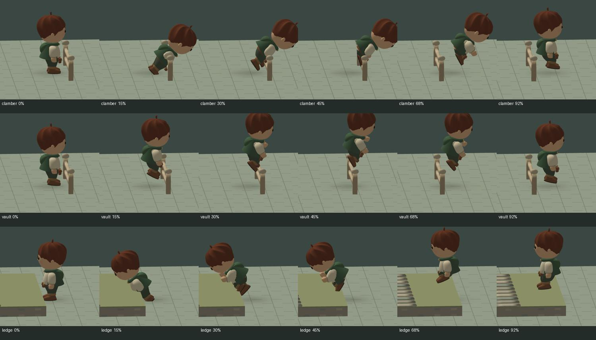

# よじ登りと「身軽な乗り越え」

通常の移動入力で柵・低い石垣・段差へ進むと、手をかけ、体を引き上げ、脚を越して着地する。パッシブ「身軽な乗り越え」(60905 / `bl.skill.nimble_vault`) を習得すると、低い柵・石垣だけが素早い飛び越えになる。高台への登り降りは引き続き手を使う。

- 柵：通常 1.35 秒、習得後 0.68 秒。段差：1.05 + 高さの差 × 0.2 秒。
- 探索と軽い足運びの異なる経験から既存の閃き抽選で習得。完了した乗り越えを経験として記録する。開始・中断だけでは記録しない。回数による確定配布や専用ボタンは設けない。
- 腕または脚の重傷・欠損、抱っこ中、行動不能、救助運搬中などでは開始不可。習得後も高さ・方向・障害物・着地範囲の制限は同じ。通行可能な階段はそのまま利用できる。
- 開始時に動作・縁の位置・高さを Simulation に保存。途中の習得で動作を切り替えない。武器と盾を描画上収め、年齢・種族の腕の長さで両手を縁へ合わせる。届かない位置では手を伸ばし切らず、接触を解除する。
- 新しいよじ登りは、足を畳んで柵を越える低い軌道。上り段差は足が段を横切る前に体を引き上げる。下りは縁の側を向いたまま降りる。
- 通常保存の途中再開は支持された側へ戻す。live 再接続は動作・習得状態を維持。`profile` のない旧 live 動作は以前の軌道を保持し、既存の保存済み技を自動付与・削除しない。
- 描画補間も位置と同じ割合でよじ登りの進行を補間し、開始・着地で空中姿勢と接地状態を混ぜない。

## 証拠と再現



画像は実際の Simulation、Travelers のスキニング行列、ArtDirector の地形を使った EGL / llvmpipe 診断。ブラウザ画像ではない。人間の若年モデルを側面から各段階で確認。4 種族 × 4・24・80 歳の有限な骨・腕の到達範囲・両手の別々の接触はテストで確認する。

```
node tests/clamber-motion-evidence.mjs
python tools/render-clamber-review.py verification/current/clamber
```

実行した Build・関連 Test の結果は PR 本文を参照。テストは 30/60/120 Hz、両側の高台、閃き・既習得・未習得、手足の負傷、救助、被弾中断、保存・live 復帰、旧動作、描画補間を含む。

ブラウザからの通常入力・カメラ操作・Pixel Fold 実機・DEV 配布後確認は **UNVERIFIED**。この WORK のブラウザ経路は `net::ERR_BLOCKED_BY_CLIENT` のため、Integration WORK の DEV 確認へ引き継ぐ。EGL 診断をブラウザ検証や実機 FPS と扱わない。

## 統合上の注意

開始 develop: `10fb501e635f953c529dfbfc6898d8c0fd21e66c`。作業中に統合された #57 を取り込み、公開の基準は `56588fe73bb9716cf619afeae1ce128023a0a7f5`。#54 の高低差と #56 の年齢モデルは統合済み。添付共通ポリシー v5、実装プロンプトの担当節、#67 の v6 文書を確認。

- #60：生成カタログを保持しつつ `vault` passive operator の検証許可と 60905 を残す。カタログ件数は合算する。閃きの間隔や combat RNG を変更しない。
- #62・#66：攻撃の足運び、表情・負傷の重ね合わせを保持。よじ登りは共有 `artPose` と、攻撃クリップ外の手の IK を使用する。
- #59：船の手すりをよじ登り可能にしない。船側の開始拒否条件と、新しい描画補間・既存の移動性能改善を保持する。
- #68：行動不能・運搬中の開始拒否と、負傷者用の階段を保持する。
- 複数の core / catalog 変更を合わせた場合、既存の immutable rules を残して、統合後の Simulation archive を再生成する。
