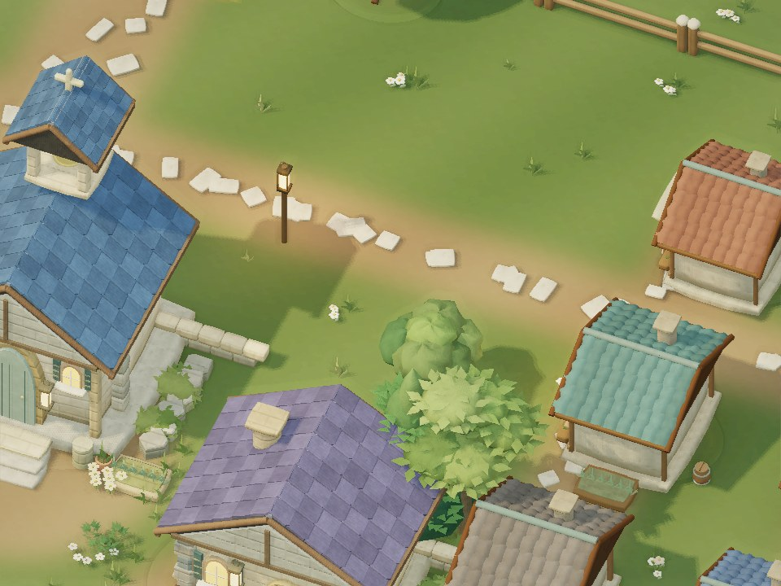
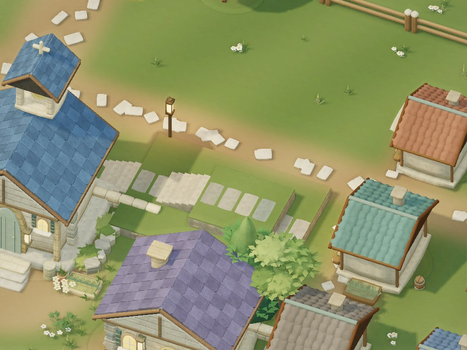

# 村の段丘とパルクール経路

> **REFERENCE — この領域の技術・実装資料。** ゲームの確定仕様の正本を置き換える文書ではありません。本文の旧ポリシー、WORK固有の指示、PR依存・SHA・検証結果はhistoricalな来歴で、現在の共通運用やGitHub状態には適用しません。[現行の文書案内](../README.md)。

開始基点: `8c5a03e0bee563452d21f9ce9c5571271f017b58`。公開前に develop `957362c`（#47 世界速度・死亡導線、#48 起動修正）を取り込み、再検証しました。Project Sources: 共通開発運用ポリシー v5 / 実装プロンプト v2。今回のユーザー指示と v5 の Ready PR 運用を優先します。

## 遊べる場所

- 教会・図書館の北側に、広さ 8×5.6、高さ 0.6 の下段と、高さ 1.2 の上段を追加。縁に向かって移動すると 0.6 ずつ登り降りできます。
- 道場手前の従来の3段を維持し、最上段を幅 6.4 へ拡張。広場側から上り下りできる石段を追加。
- 反対側の緑地に高さ 1.05、幅 5 の低い石垣を追加。既存の柵と同じ移動入力で越えます。
- 北側の上下段と南側の石段には、高さ 0.1・奥行き 0.3 の歩ける階段があります。パルクールできない脚の負傷・幼少期・救助運搬中でも利用できます。
- 種により村は左右反転します。30軒の家、施設、井戸、主要道路、港、門、既存の操作は維持します。

## 地形と状態の責任

`makeVillage` の `traversables` を描画・支持面・衝突で共有。屋根や任意の壁を登れる仕様には広げていません。跳躍先の全身分の足場、途中の高い障害物、占有状態を検証します。攻撃の踏み込みや負傷者の歩行でも、石垣から突然地面へ移動することを防ぎます。

新4種族とCM01の空中位置は、補間済みのシミュレーション高さへ直接合わせます。地面へ引き戻す遅れを除き、既存のパルクール姿勢と着地後の接地補正を使用。新モデルの形状・攻撃振付は変更しません。

旧セーブで地形追加箇所にいた人物は、同じ場所の支持面へ合わせます。行動不能・記録・継承は保持。通常再読込は既存の中断復帰、live restart は進行中のパルクールを保持します。

共有世界のsnapshotに `terrainRevision` を追加。新版クライアントが旧ルールで動く世界へ接続した場合は、旧地形を描画します。地形版が変わると静的描画と地面のキャッシュも再構築。既存ルールアーカイブ・protocol / snapshot / save schema の番号を保持し、新ルールは現行の安全な移行経路へ追加しました。

## 検証

- Build / 全テスト **461 PASS、0 FAIL、0 SKIP**。`npm test` と同じ全対象を `node --test --test-concurrency=2` で実行。
- 専用11件: 左右24 seed、30/60/120 Hzの登り降り、階段往復、脚負傷・幼少期・運搬、占有着地、高い段差、攻撃中の足場、通常 / live 保存復元、旧・新地形の描画選択。
- 新4種族すべてで実Simulation → 実リグの連続した登り・着地・下降を確認。空中の高さ、地上での足底、有限な骨行列、描画によるゲーム状態の不変性を検証。
- 既存の戦闘・被弾・盾・スキル・救助・継承・入力・live互換性の回帰を実行。旧被弾比較からは今回の地形版メタデータだけを除外し、ダメージ・タイマー・イベント数・乱数の比較は維持。
- DEV配布Build / 資産・ルールアーカイブ整合性検査: PASS。
- 実ゲームのgeometry / GLSL / drawBatchesを使用したnative EGL画像比較。重なった天面のちらつきを修正し再描画。
- 比較条件: seed 7349、960×720、medium、同一カメラ・晴天、キャラ非表示。影更新を含む三角形 **505,344 → 511,866（+1.29%）**、描画呼び出し **46 → 46**。新しい描画パス・textureなし。
- 単一キャラの共通移動処理のNode CPU診断（3回）: p50 **0.021–0.025 → 0.050–0.053 ms**。足場検査のコスト増があります。全体FPS・GPU時間ではありません。条件と生値は `evidence/movement-cpu.json`。

**未検証:** このWORKでのBrowser入力・本編の新モデル連続映像、Pixel Fold実機、native GPU / frame pacing。先行試行のBrowserアクセス拒否を維持し、EGL診断や数値テストをBrowser Verificationとは扱いません。

| Before | After |
|---|---|
|  |  |

画像はブラウザスクリーンショットではなく、実ゲーム描画データのオフライン診断です。

## 再現

```sh
npm ci
npm run build
node --test tests/village-terrain.test.mjs tests/traversal.test.mjs tests/character-travelers.test.mjs
node tests/terrain-performance.mjs 8c5a03e0bee563452d21f9ce9c5571271f017b58
node tests/export_scene.mjs . verification/current/terrain '{"x":10.5,"z":-15.2,"zoom":15,"yaw":0.4,"pitch":0.85,"characters":false}'
python tests/render_offline.py verification/current/terrain public/assets
```

EGL診断のPython依存は既存 `tests/offline-requirements.txt`。実機では、移動ドラッグ / カメラ回転で両段丘と石垣を往復し、通常カメラでのめり込み・着地・操作感と保存復帰を確認してください。

## 並行PRとの統合

- #49: `GoldenArt.village` の舗装生成に今回の足場除外を保持。井戸・狩人小屋のUVアセットは置換しません。
- #50: travelerのクリップ選択と固定長の腕・脚を維持し、今回の空中高さの追従を残す。パルクールは既存のクリップ除外条件に従います。
- #51: `moveAttackStep` の接触間隔・候補絞り込みと、今回の支持面検査を併存させる。再利用する `bounded` に毎回 `q.supportHeight` をコピーすること。押し戻しも崖から落とさない必要があります。
- #52: 敵種族・描画分岐を維持し、段丘の描画・collisionを残す。
- #53: 意識 / 身支度のデザインに本PRの変更はありません。

変更の中心: `legacy/core.js` / `art.js` / `game.js`、`world/environment.js` / `golden-slice.js`、`render/renderer-base.js`、キャラruntimeの高さ追従、専用テスト、追加のimmutable rules archive。Ready for review、mergeはIntegration WORKへ委ねます。
